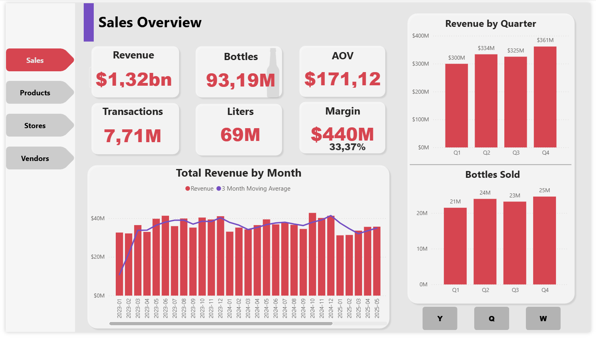
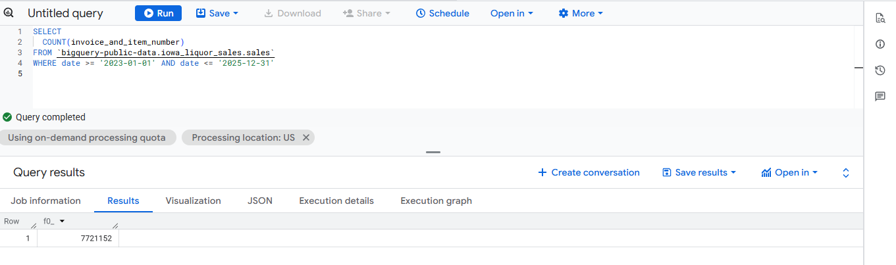
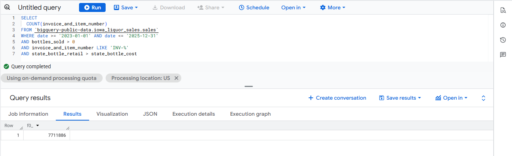
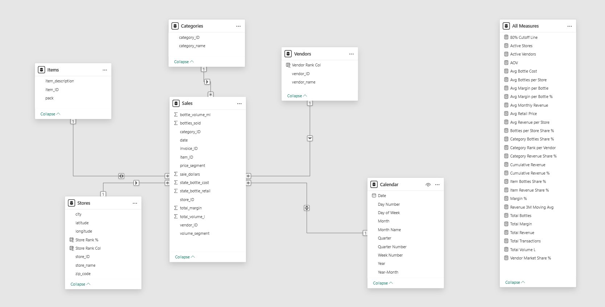
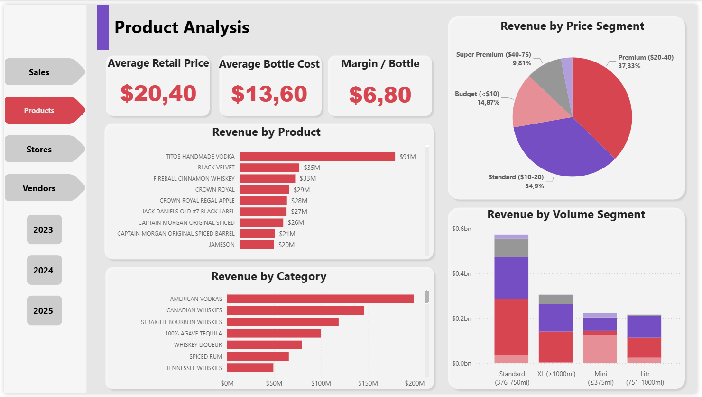
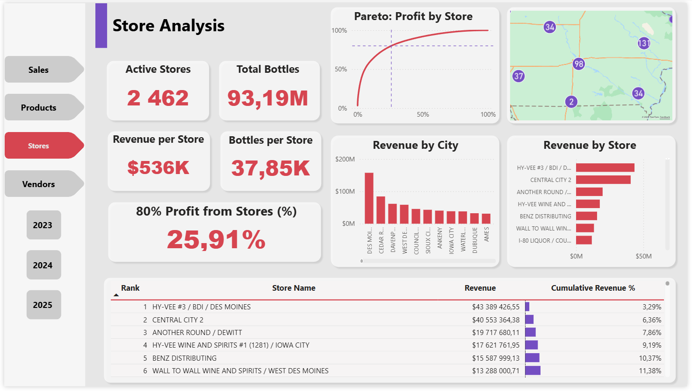
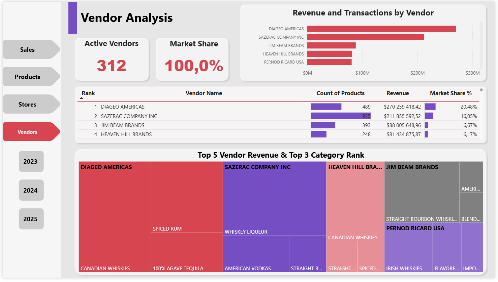

# 🥃 Iowa Alcohol Retail — Power BI Dashboard

Interaktivní analytický dashboard maloobchodního prodeje alkoholu ve státě Iowa (USA) za období **2023–2025**, postavený v **Power BI** s přímým připojením na **Google BigQuery**.

- *Analyzované celkové tržby*: 1,32 mld. USD

- *Paretovo pravidlo*: 26 % prodejen generuje 80 % zisku

- *Tržní podíl*: Společnost Diageo ovládá 20 % trhu

[Stáhnout .pbix file](https://drive.google.com/file/d/1mvvEK9WqH8Hb118glqic3K7snPPkT9_C/view?usp=drive_link)



*Ukázka dashboardu — maloobchodní prodej alkoholu ve státě Iowa, 2023–2025*


---

## 📌 Popis projektu a cíl analýzy

Stát Iowa v USA veřejně publikuje data o všech velkoobchodních objednávkách alkoholu, které jednotlivé prodejny zadávají u distributorů. Dataset obsahuje informace o prodejnách, produktech, dodavatelích, cenách, objemech a maržích za více než 10 let.

Cílem tohoto projektu bylo vytvořit interaktivní dashboard, který odpoví na klíčové otázky:

1. **Jak se vyvíjejí prodeje?**
2. **Které produkty a kategorie generují nejvyšší tržby?** 
3. **Jak jsou distribuovány prodejny?** 
4. **Kdo jsou hlavní dodavatelé a jakou mají tržní pozici?**

## Data pipeline

**BigQuery** (veřejný dataset)
      ↓
**SQL** preprocessing [`sql/`](sql/)
      ↓
**Power BI** datový model
      ↓
Interactivní **dashboard**

---

## 📊 Klíčové metriky

| Metrika | Hodnota |
|---|---|
| Celkové tržby | $1,32 mld |
| Prodané lahve | 93,19 mil |
| Počet transakcí | 7,71 mil |
| Objem (litry) | 69 mil |
| Celková marže | $440 mil (33,37 %) |
| Průměrná hodnota objednávky (AOV) | $171,12 |
| Aktivní prodejny | 2 462 |
| Aktivní dodavatelé | 312 |

---

## 🗄️ Data a zdroj

**Zdroj:** veřejný dataset [Iowa Liquor Sales](https://console.cloud.google.com/bigquery?p=bigquery-public-data&d=iowa_liquor_sales&t=sales) v Google BigQuery (`bigquery-public-data.iowa_liquor_sales.sales`).

**Období:** leden 2023 – prosinec 2025. Rok 2026 byl záměrně vyloučen, aby neúplná data za aktuální rok nevytvářela falešný dojem poklesu prodejů.

**Rozsah surových dat:** 7 721 152 záznamů za zvolené období.

**Rozsah po čištění:** 7 711 886 záznamů (odstraněno 9 266 řádků, tj. 0,12 %).

### Klíčové sloupce v surových datech

`invoice_and_item_number`, `date`, `store_number`, `store_name`, `city`, `zip_code`, `store_location` (GPS), `category`, `category_name`, `vendor_number`, `vendor_name`, `item_number`, `item_description`, `pack`, `bottle_volume_ml`, `state_bottle_cost`, `state_bottle_retail`, `bottles_sold`, `sale_dollars`

---

## 🧹 Příprava a čištění dat

Data byla načtena přímo z BigQuery do Power BI pomocí SQL dotazů. Čištění a filtrace byly provedeny na straně BigQuery (před importem), aby se snížil objem přenesených dat a zrychlil model.

### Filtrace faktové tabulky Sales

| Filtr | Důvod | Odstraněno řádků |
|---|---|---|
| `bottles_sold > 0` | Vyloučení vratek — záznamy se záporným počtem lahví představují vrácení zboží, nikoli prodej | 9061|
| `invoice_and_item_number LIKE 'INV-%'` | 19 záznamů typu „credit memo" mělo chybně kladné hodnoty — šlo o účetní opravy, ne o skutečné prodeje | 19 |
| `state_bottle_retail > state_bottle_cost` | 49 záznamů mělo nulovou maloobchodní cenu (`state_bottle_retail = 0`), přičemž `sale_dollars > 0` — jde o datové nesrovnalosti. Zbývajících 137 vyloučených záznamů měly maloobchodní cenu nižší než nákladovou, což rovněž indikuje chybu v datech | 186|

**Celkem:** ze 7 721 152 → 7 711 886 záznamů.




### Transformace v SQL a Power Query

- **Deduplikace prodejen (Stores):** některé prodejny měly více záznamů s různým zaokrouhlením GPS souřadnic. Řešení: okenní funkce pro výběr jednoho záznamu na prodejnu.
- **Čištění názvů prodejen:** z pole `store_name` byl odstraněn název města, který se duplikoval se sloupcem `city`.
- **Optimalizace datových typů:** primární a cizí klíče (`invoice_ID`, `store_ID`, `vendor_ID`, `category_ID`, `item_ID`) byly převedeny na celočíselné formáty pro zrychlení modelu a snížení velikosti souboru.
- **Vypočítané sloupce v Power Query:**
  - `total_margin` = `sale_dollars` − (`state_bottle_cost` × `bottles_sold`)
  - `total_volume_l` = (`bottle_volume_ml` × `bottles_sold`) / 1000
  - `price_segment` — kategorizace podle maloobchodní ceny lahve (Budget <$10, Standard $10–20, Premium $20–40, Super Premium $40–75, Ultra Premium $75+)
  - `volume_segment` — kategorizace podle objemu lahve (Mini ≤375ml, Standard 376–750ml, Litr 751–1000ml, XL >1000ml)

---

## 🗂️ Datový model

**Star schema** s faktovou tabulkou **Sales** a 5 dimenzemi:

- **Sales** (fakt) — invoice_ID, date, bottle_volume_ml, state_bottle_cost, state_bottle_retail, bottles_sold, sale_dollars, total_margin, total_volume_l, store_ID, category_ID, item_ID, vendor_ID, price_segment, volume_segment
- **Items** — item_ID, item_description, pack
- **Categories** — category_ID, category_name
- **Vendors** — vendor_ID, vendor_name
- **Stores** — store_ID, store_name, city, zip_code, latitude, longitude
- **Calendar** — Date, Year, Month, Month Name, Quarter, Day of Week, Year-Month, Week Number, Day Number, Quarter Number

### Kalendářní tabulka

```dax
Calendar =
    ADDCOLUMNS(
        CALENDARAUTO(),
        "Year",          FORMAT([Date], "YYYY", "en-US"),
        "Month",         MONTH([Date]),
        "Month Name",    FORMAT([Date], "MMMM", "en-US"),
        "Quarter",       "Q" & QUARTER([Date]),
        "Day of Week",   FORMAT([Date], "ddd", "en-US"),
        "Year-Month",    FORMAT([Date], "YYYY-MM"),
        "Week Number",   WEEKNUM([Date]),
        "Day Number",    WEEKDAY([Date], 2),
        "Quarter Number", QUARTER([Date])
    )
```



---

## 📄 Stránky dashboardu

### 1. Sales Overview


Celkový přehled prodejů s 6 KPI kartami, vývojem tržeb po měsících s **3měsíčním klouzavým průměrem** a přepínačem časového období (**Y / Q / W**). V režimu „W" (den v týdnu) jsou **víkendové dny barevně odlišeny** jako součást storytellingu — prodeje v sobotu a neděli ($14M a $28M) jsou výrazně nižší než v pracovních dnech ($232–275M), což odpovídá velkoobchodnímu charakteru dat. Rok 2025 je rovněž barevně odlišen pro zvýraznění poklesu tržeb.

### 2. Product Analysis



Analýza produktového portfolia — **top produktů** a **top kategorií** podle tržeb, průměrná maloobchodní cena ($20,40), nákladová cena ($13,60) a marže na lahev ($6,80). Segmentace tržeb podle **cenového pásma** a **objemu lahve**. Filtrování podle roku umožňuje sledovat změny v produktových preferencích.

### 3. Store Analysis



Analýza prodejen s **Pareto grafem** (25,91 % prodejen generuje 80 % zisku), **mapou Iowy** s rozmístěním prodejen, tržbami podle města a tabulkou top prodejen s kumulativním podílem na tržbách. Data bars v tabulce vizualizují kumulativní podíl.

### 4. Vendor Analysis



Přehled dodavatelů s **treemapou** top 5 dodavatelů a jejich hlavních kategorií. Tabulka s rankingem, počtem produktů, tržbami a tržním podílem. Interaktivní tooltip s detaily při najetí na treemapu. Slicery umožňují filtraci podle roku.

---

## 💡 Závěry a doporučení

### Sales

- Tržby stagnovaly v letech 2023–2024 ($447M → $448M) a v roce 2025 **klesly** na $425M. Počet prodaných lahví rovněž mírně klesá (31M → 31M → 30M).
- Výrazná sezónnost: **Q4 je stabilně nejsilnější kvartál** ($361M souhrnně). Q1 je nejslabší ($300M).
- **Prodeje jsou soustředěny do pracovních dnů** (pondělí–pátek). Víkendové prodeje ($14M sobota, $28M neděle) tvoří zlomek — data zachycují velkoobchodní objednávky prodejen, nikoli nákupy koncových zákazníků.

### Products

- **Tito's Handmade Vodka** dominuje s tržbami $91M — téměř 3× více než druhý v pořadí (Black Velvet, $35M).
- **American Vodkas** je největší kategorie. Standardní cenový segment ($10–20) tvoří ~35 % tržeb, Premium ($20–40) ~37 %.
- Standardní objem lahve (376–750ml) generuje ~44 % tržeb.

### Stores

- Vysoká koncentrace: **pouze 25,91 % prodejen generuje 80 % zisku** (Pareto). To znamená, že většina prodejen je maloobjemová.
- **Hy-Vee #3 / BDI / Des Moines** je absolutní lídr ($43,4M). Des Moines jako město dominuje s velkým náskokem.
- Průměrná tržba na prodejnu: $536K, průměrný počet lahví na prodejnu: 37 850.

### Vendors

- **Diageo Americas** vede trh s podílem 20,48 % ($270M, 489 produktů).
- **Sazerac Company** je druhý (16,05 %, $212M), ale s téměř dvojnásobným portfoliem (955 produktů).
- **Top 4 dodavatelé kontrolují ~49 % trhu.** Zbývajících 308 dodavatelů sdílí druhou polovinu.

### Doporučení

1. **Pokles tržeb v 2025** vyžaduje hlubší analýzu příčin — zda jde o pokles poptávky, změnu sortimentu nebo úbytek aktivních prodejen.
2. **Pareto efekt (26 % prodejen = 80 % zisku)** naznačuje příležitost pro cílené programy pro „dlouhý ocas" menších prodejen.
3. **Sazerac** by mohl zvážit racionalizaci portfolia — při 955 nabízených produktů dosahuje nižšího tržního podílu než **Diageo** s 489 nabízených produktů.

---

## 🛠️ Technologie

- **Power BI Desktop** — vizualizace, datový model, [DAX míry](dax/dax_measures.md)
- **Google BigQuery** — zdroj dat, [SQL dotazy](sql/)
- **SQL** — extrakce, filtrace a transformace dat
- **DAX** — výpočetní míry, kalendářní tabulka, Pareto analýza

---

## 📁 Struktura repozitáře

```
iowa-alcohol-retail/

├── sql/
│   ├── fact_sales.sql
│   ├── dim_store.sql
│   ├── dim_product.sql
│   ├── dim_vendor.sql
│   └── dim_category.sql
├── dax/
│   └── dax_measures.md
├── screenshots/
│   ├── sales_overview.png
│   ├── sales_quarter.png
│   ├── sales_weekday.png
│   ├── product_analysis.png
│   ├── store_analysis.png
│   ├── vendor_analysis.png
│   ├── data_model.png
│   ├── raw_data_count.png
│   └── filtered_data_count.png
└── README.md
```

---

## 👤 Autor

**Jekaterina Gainullina** 

[](https://www.linkedin.com/in/jekaterina-gainullina/)

